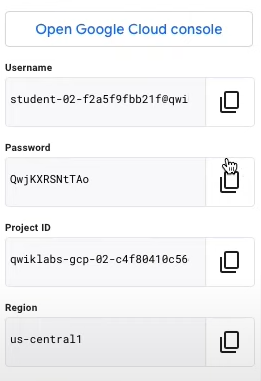
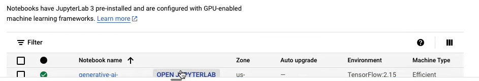
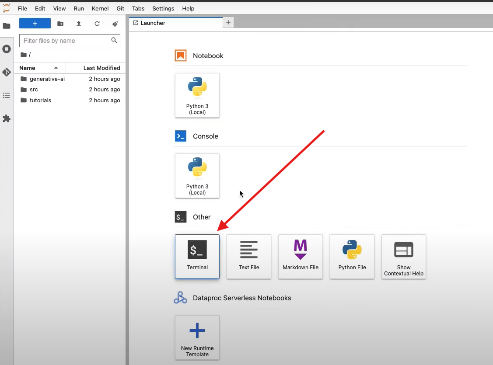
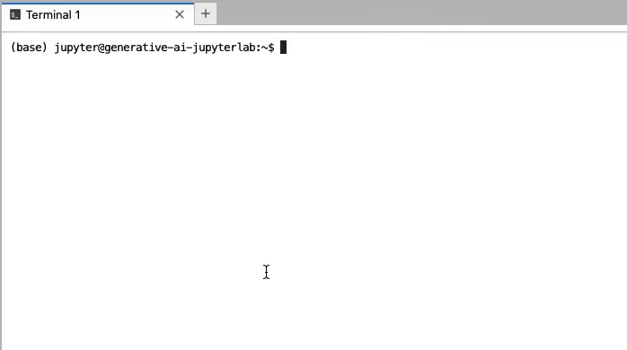
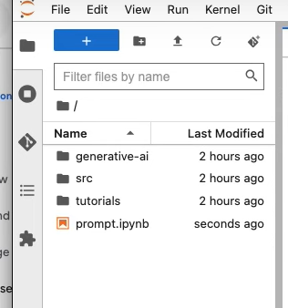
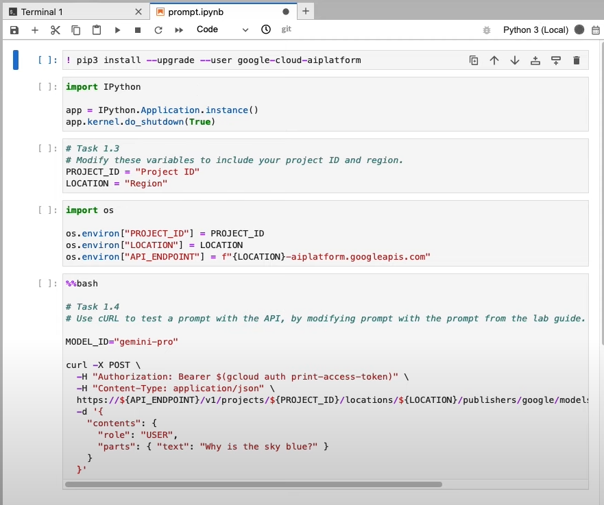
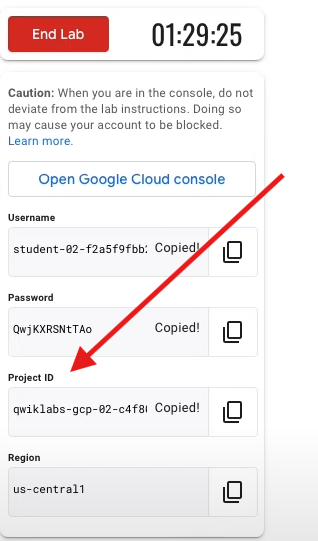
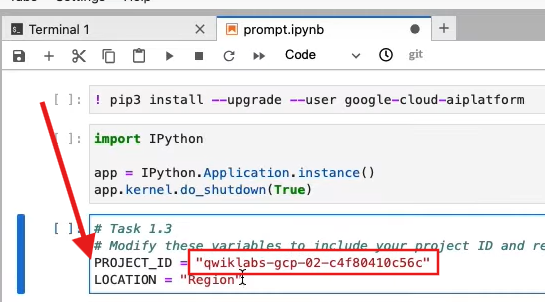
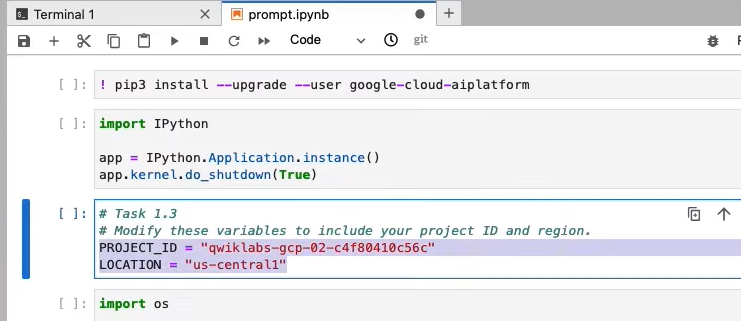

# Google Cloud Skills Boost Lab

## Getting Started

1. Begin the Google Cloud Skills Boost lab.

2. Log in to 'Google Cloud Console' with the provided student ID 

   .

3. Open Google Cloud Shell from the top-right icon on the ribbon 

   .

4. Search for 'Workbench' in the search bar and open Workbench (Open AI).

5. Click on 'User-managed Notebooks'. 

   .

6. Click on 'Open Jupyter Notebook' 

   .

7. Wait for the notebook to load (may take a couple of minutes).

8. Once opened, open a terminal. 

   .

   .

   
## Task 1

9. In the terminal, copy-paste this command: 

    ```bash
    gsutil cp gs://spls/gsp517/prompt.ipynb
    ```

10. Open the `prompt.ipynb` file from the left side 

    

11. In the `ipynb` file, in the 5th cell, replace 'Why is the sky blue' with the following:
    ```
    I am a Chef.  I need to create Japanese recipes for customers who want low sodium meals. However, I do not want to include recipes that use ingredients associated with a peanuts food allergy. I have ahi tuna, fresh ginger, and edamame in my kitchen and other ingredients. The customer wine preference is red. Please provide some for meal recommendations. For each recommendation include preparation instructions, time to prepare and the recipe title at the begining of the response. Then include the wine paring for each recommendation. At the end of the recommendation provide the calories associated with the meal and the nutritional facts.

   .
 .

12. Copy your project ID from your lab 

     .

     and paste it in the third cell of the `ipynb` file in the `PROJECT_ID` variable. 


    Change the region similarly.
    . 

13. Once all the above variables have been changed, run each cell in the `ipynb` file from the beginning one by one (make sure the current cell runs completely and the kernel status switches to idle from busy, and then only move on to run the next cell). Similarly, run all cells one by one.

14. Wait for about one minute and check your progress in the lab.
